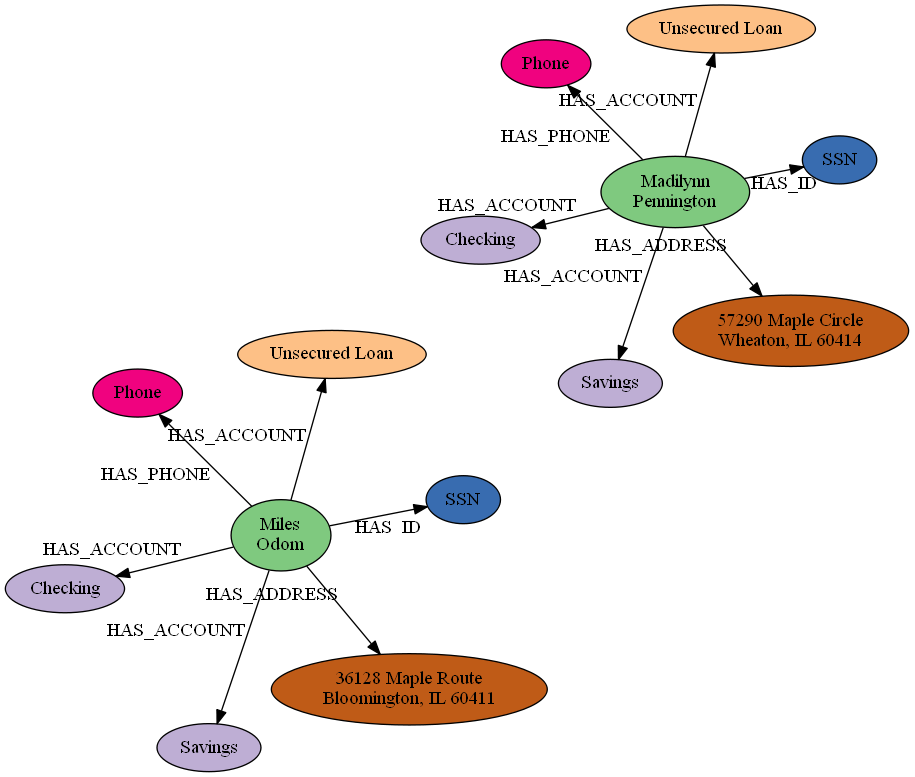
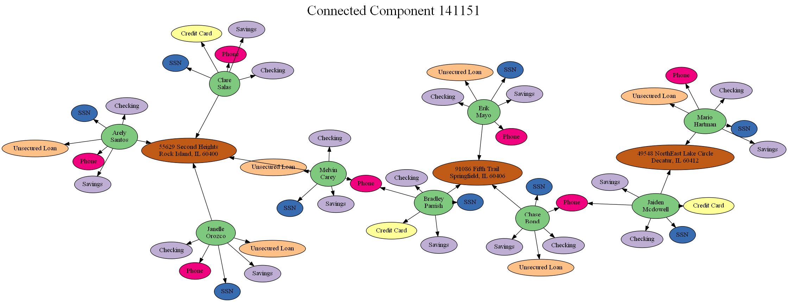
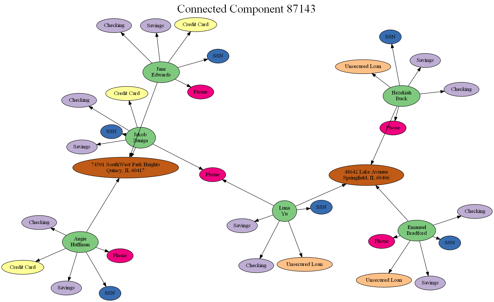
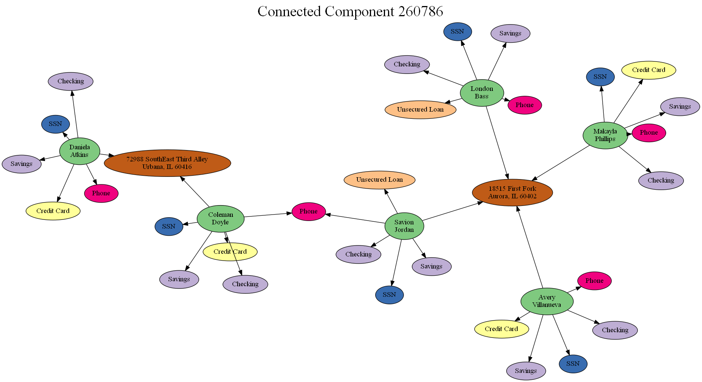
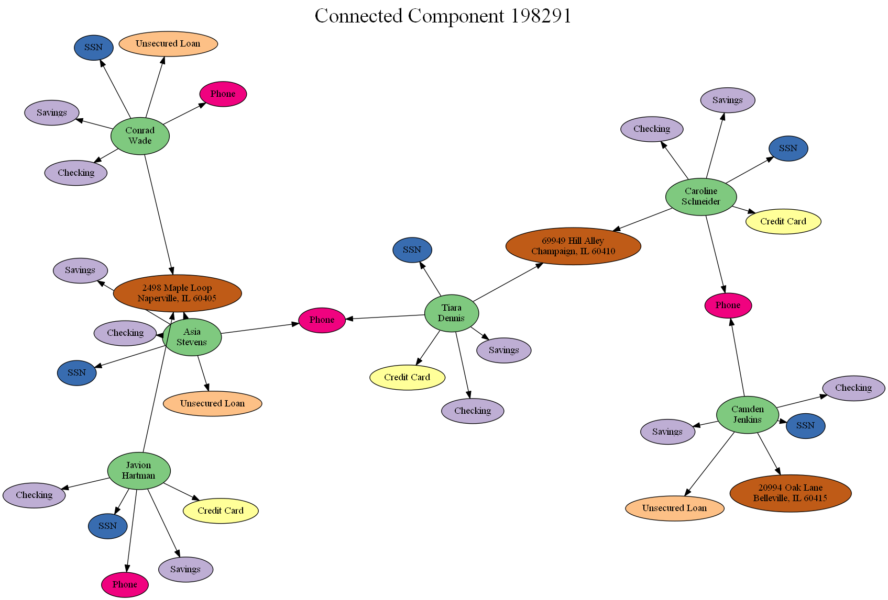
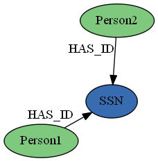
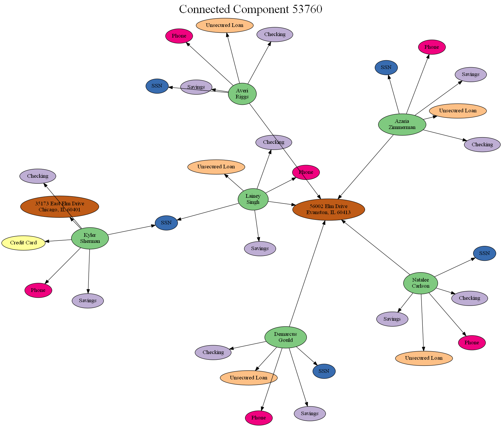
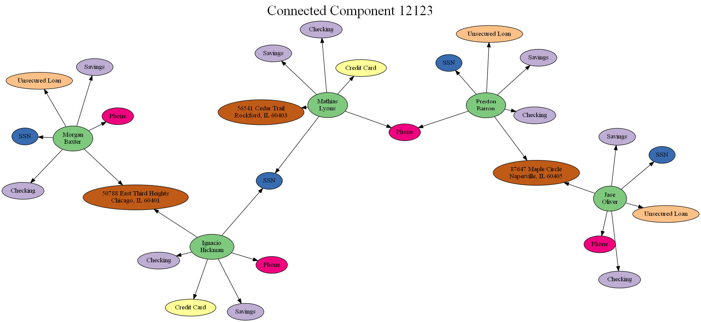
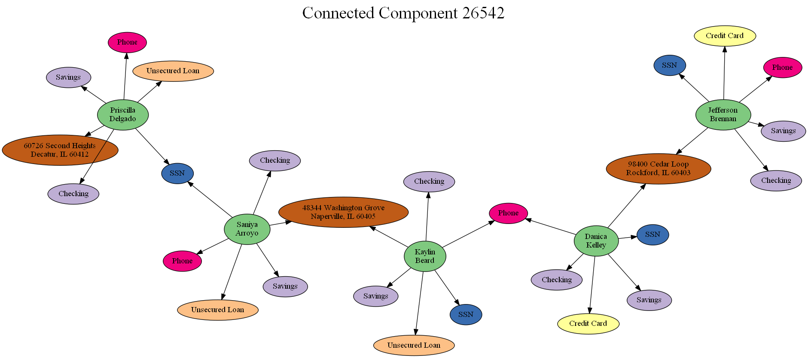
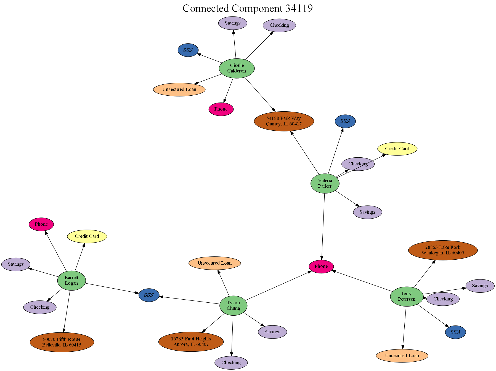

# Fraud Rings in Bank Data
   This code in this demo is based on the example given in the blog post <a href=" https://maxdemarzi.com/2020/03/20/finding-fraud-part-two-revised/amp/">"Finding Fraud Part Two Revised"</a>
   by Max De Marzi, with some changes in methodology and implementation language.

## About Fraud Rings

Fraud Rings are a type of organized crime where multiple actors participate in multiple instances of fraud, often permuting their roles or changing the story each time to hide the act. In this demo, you will construct synthetic banking data and look for fraud rings using Network analytics.

## Constructing Synthetic Data
The code provided in <a href="sas/fraud_ring_demo.sas">fraud_ring_demo.sas</a> creates mockup data where users entities are connected to various accounts and demographic facts, as in the example depicted below:

To make the synthetic data interesting, two users are mapped to the same address, phone number, or social security number with some frequency. With the provided in-script parameters, roughly 1 in 10 addresses are shared, 1 in 100 phone numbers are shared, and 1 in 1000 social security numbers are shared across users.

## Finding Potential Fraud Rings
With the data specified this way, you can search for suspicious patterns in the graph. One way to do this would be to look for large connected components: this means that large groups of individuals are interconnected by demographic overlaps.

Here are visualizations of the largest four connected components in the graph:

Those cases might be suspicious and interesting, or they might be harmless coincidence - sharing of addresses and/or phone numbers is commonplace, although very large components may still arouse suspicion.

## Refining Results via PatternMatch
One thing that would certainly raise a flag would be two users sharing a SSN, since this identifier is supposed to be unique to each person. Using PatternMatch, you can identify instances of this suspicious pattern: two individuals sharing a social security number.

Some postprocessing allows you to visualize the four largest connected components that contain this pattern:

