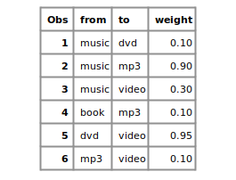
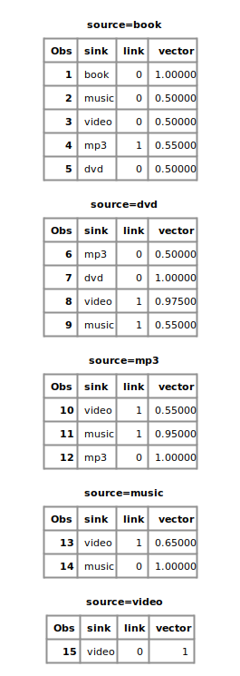
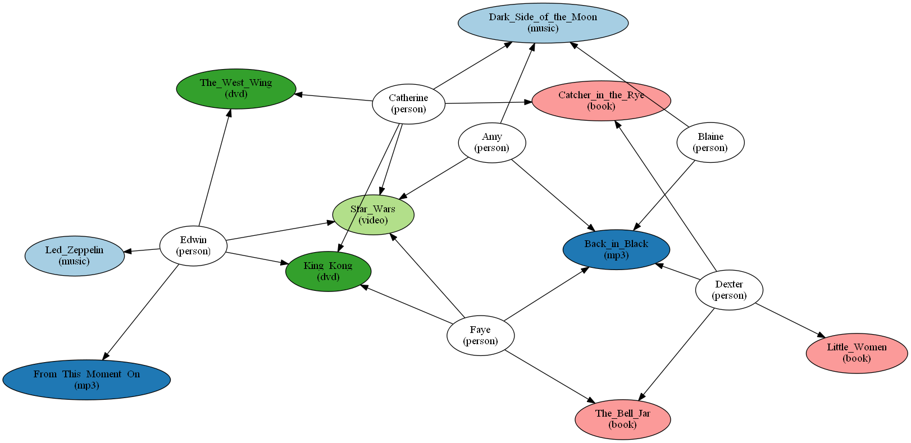
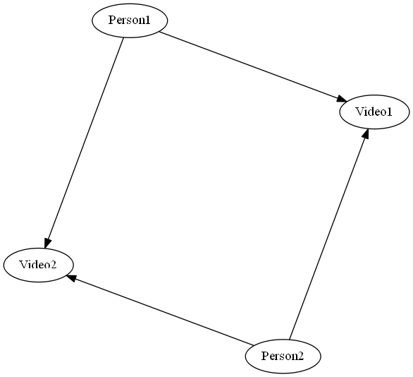
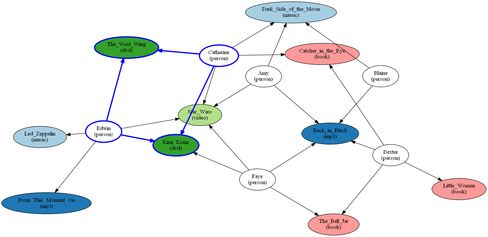
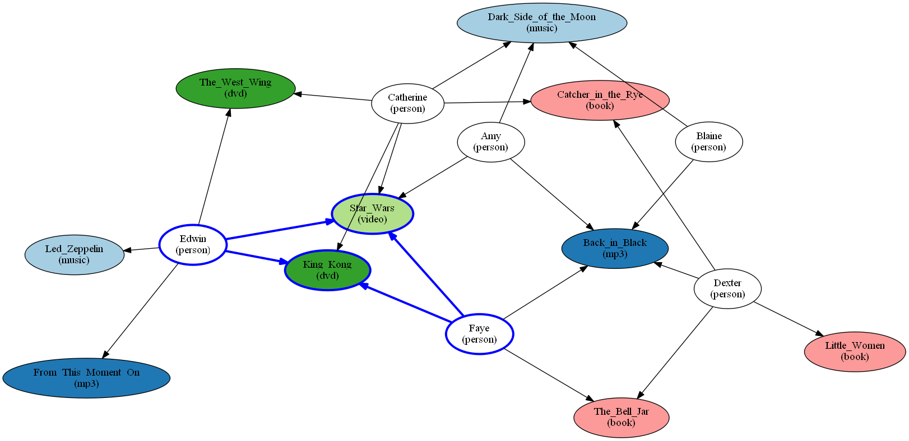
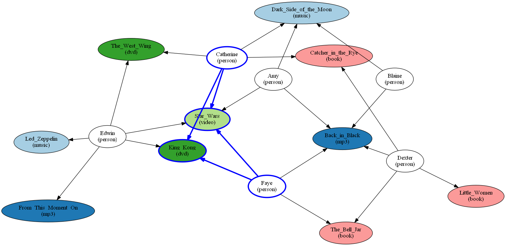
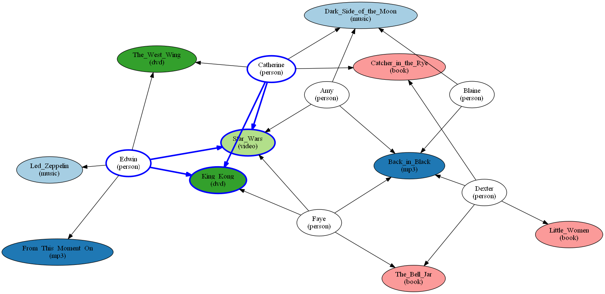

# Word Embeddings for Approximate Pattern Matching

This demo illustrates how to learn word embeddings using node similarity and apply those embeddings to perform approximate pattern matching.

## Learning Word Embeddings

This example uses embeddings learning feature of vector node similarity to train embeddings for a set of words. Word embeddings are vectors assigned per-word such that similar words have a vector dot product close to one, and unrelated words have a vector dot product close to zero.

In this example, you can assign embedding vectors to five words based on the raw data depicted below:

In practice, these would typically be trained using weights based on co-occurence frequency in a large corpus.

The script <a href="sas/patternmatch_with_embeddings.sas">patternmatch_with_embeddings.sas</a> provides the steps to run node similarity to train the embedding vectors.

Below are the pairwise similarity results obtained. Note that while vector dot products range from -1 to 1, the "vector" similarity column is normalized to lie in the range 0 to 1. Unassociated words, therefore, are assigned a "vector" similarity value of 0.5.

## Approximate Pattern Matching Based on Word Embeddings

This example uses the patternMatch node filter to implement approximate, or fuzzy, pattern matching. The graph consists of the purchase history for six people who bought various types of products. The type of product is indicated by the color coding in this visualization of the purchase graph:

Below is the query of interest: find two people who purchased the same pair of video products.

Only, instead of strictly matching for type=<i>video</i> we would like to specify an approximate match, i.e. type = <i>video or similar</i>.

To accomplish this, we will represent words in a vector space using word embedding vectors. In this representation, two words with similar meaning will have dot product close to 1, while two unrelated words will have dot product close to 0. To continue the example, we utilize the word embeddings of five words using the method described above. In practice, pre-trained word embeddings could be used instead of learning them here. 

The latter portion of the script <a href="sas/patternmatch_with_embeddings.sas">patternmatch_with_embeddings.sas</a> provides the steps to run pattern matching to achieve the following query results.

Below are the five matches returned that identify "dvd" nodes as <i>approximate matches</i> for "video" nodes:

