# inmate-network

This demonstration uses PatternMatch to query data from a fictional prison network.

The Data
============

The data used in this demonstration is generated using the script <a href="sas/mockup_inmate_data.sas">mockup_inmate_data.sas</a>. The script simulates a prison population by assigning 40,000 randomly generated inmates to prison cells for sentences of varying length. The length of first-time and repeat inmate sentences are based on the tabulated cumulative density function:

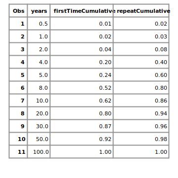

Furthermore, the cells are hierarchically organized into sections, prisons and regions according to the depicted data model:

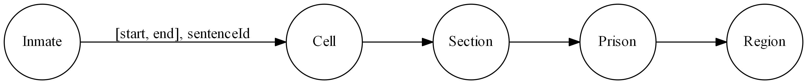

Based on this data, a number of questions about the data can be answered using PatternMatch queries, which are found in the script <a href="sas/inmate_pattern_matching.sas">inmate_pattern_matching.sas</a>

## Example 1

The first example's query finds individuals who shared a prison cell with the hypothetical mob boss, Jett Mccormick. The time intervals of cell occupancy must overlap to result in a match.

Here is a visualization of the query graph (the  topology being searched):

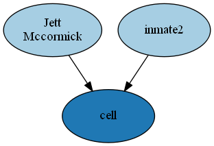

The first three resulting matches are depicted below:

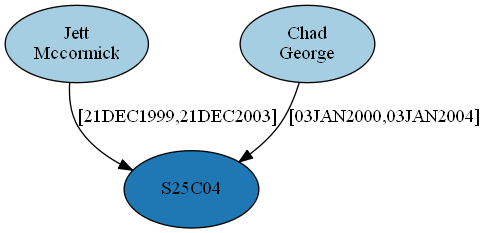
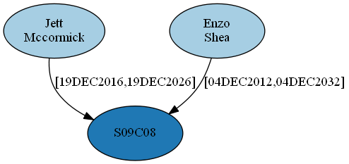
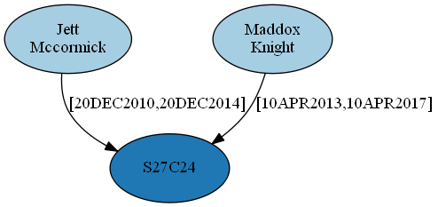

## Example 2

The second example's queries looks for individuals who were in the same section at the same time as Jett Mccormick. The queries are visualized below:

**Query A &mdash; same section, same cell:**

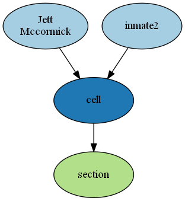

**Query B &mdash; same section, but different cell:**

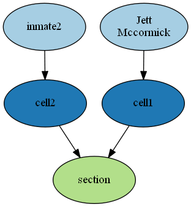

Note that by defining two query keys, *A* and *B*, you can search for two alternative topologies that satisfy the *same section* premise. Three matches per query are displayed here:

**Query A Results &mdash; same section, same cell:**

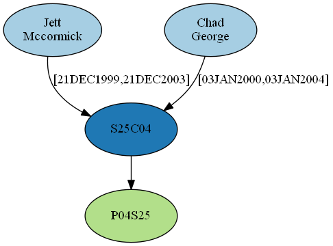
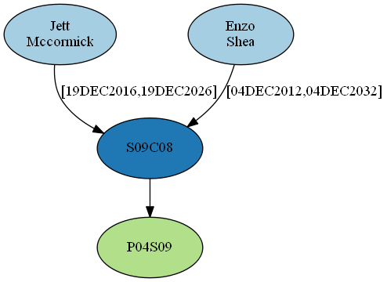
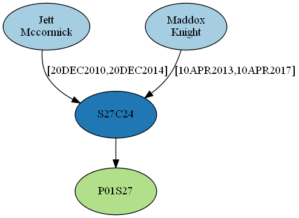

**Query B Results &mdash; same section, but different cell:**

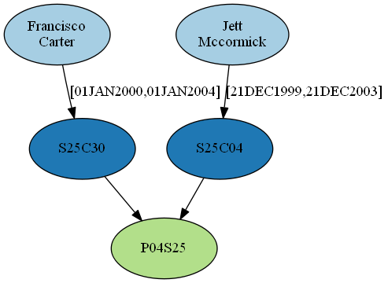

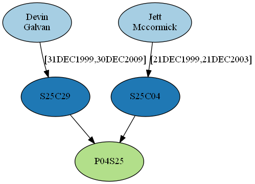

## Example 3

The third examples queries are more complex. We would like to see which sets of 3 inmates are mutual cell mates. That is, each pair of inmates among the three overlapped in the same cell at some time.

**Query key 0 &mdash; the three inmates overlapped among 3 different cells:**

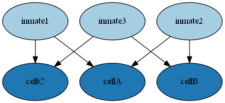

**Query key 1 &mdash; the three inmates overlapped between two different cells:**

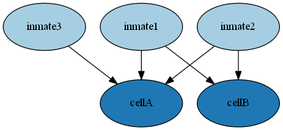

**Query key 2 &mdash; the three inmates overlapped within one cell (two inmates with double sentences in the cell):**

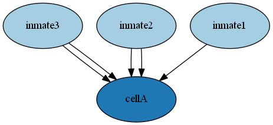

**Query key 3 &mdash; the three inmates overlapped within one cell (one inmate with double sentences in the cell):**

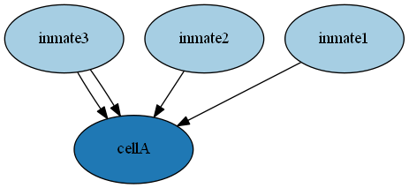

 Note that the various query keys indicate topologies for multiple ways this could happen. Among all query keys, PatternMatch finds seven matches.

**Query key 0 Results &mdash; the three inmates overlapped among 3 different cells (1 match found):**
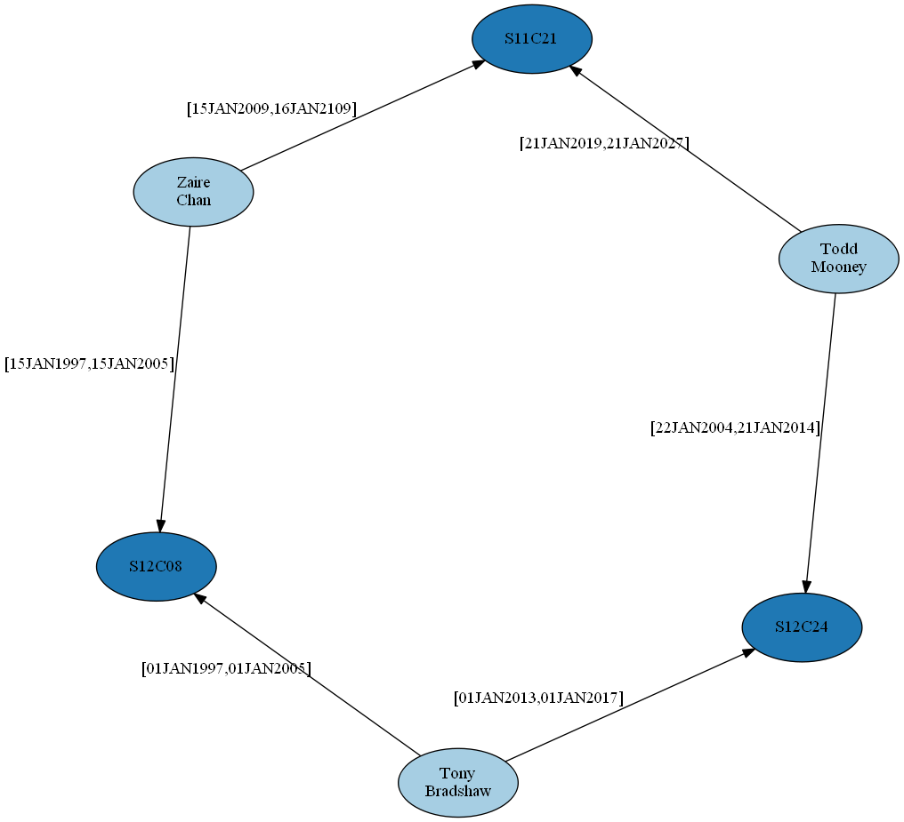

**Query key 1 Results &mdash; the three inmates overlapped between 2 different cells (3 matches found):**

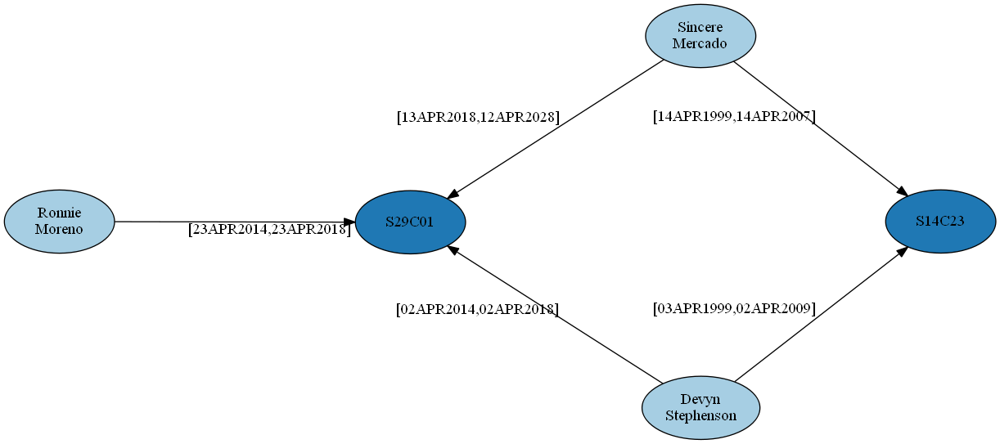
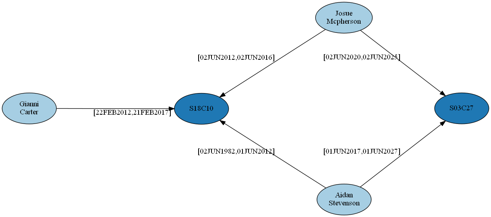
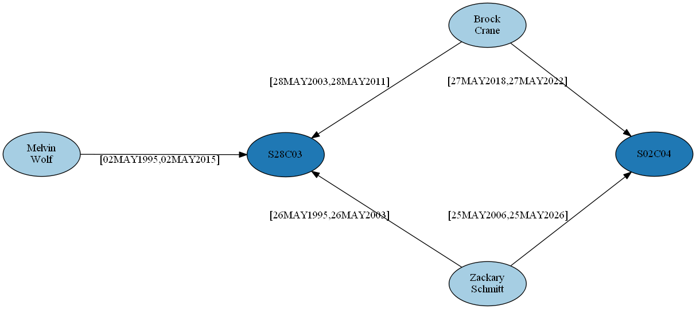

**Query key 3 Results &mdash; the three inmates overlapped in a single cell (3 matches found):**

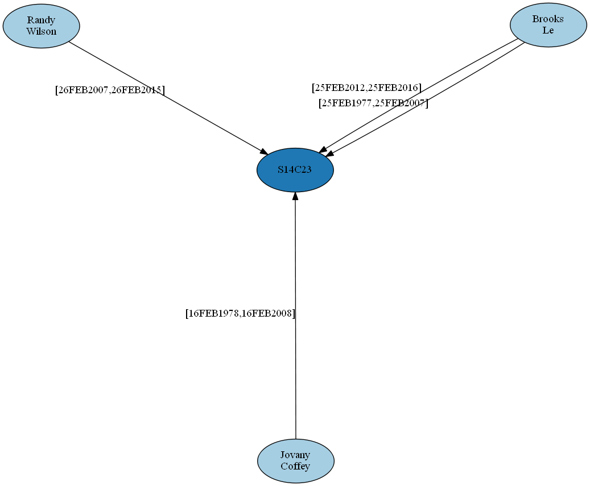
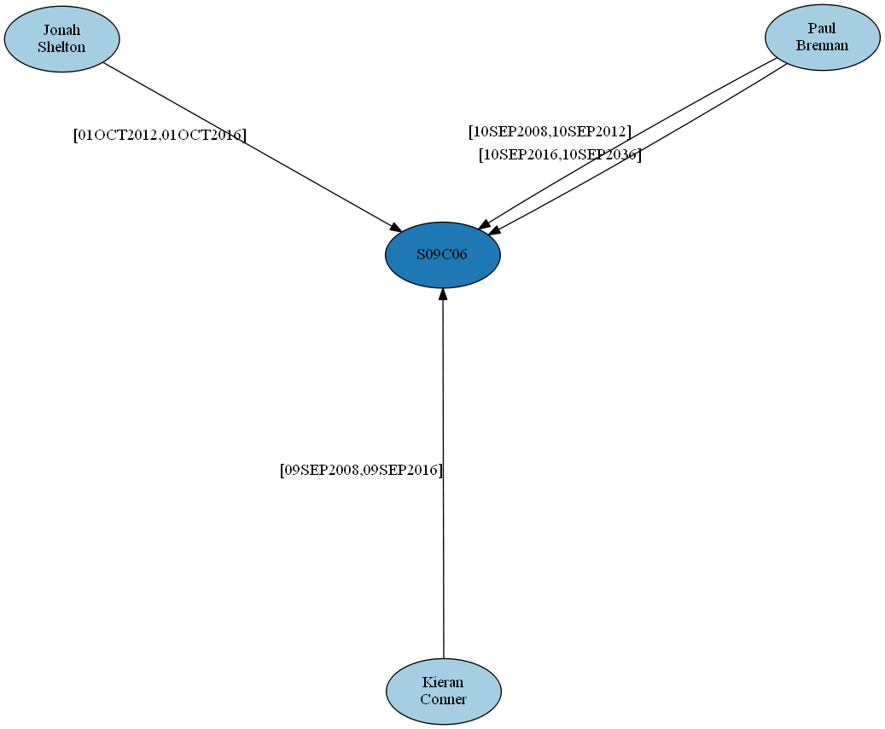
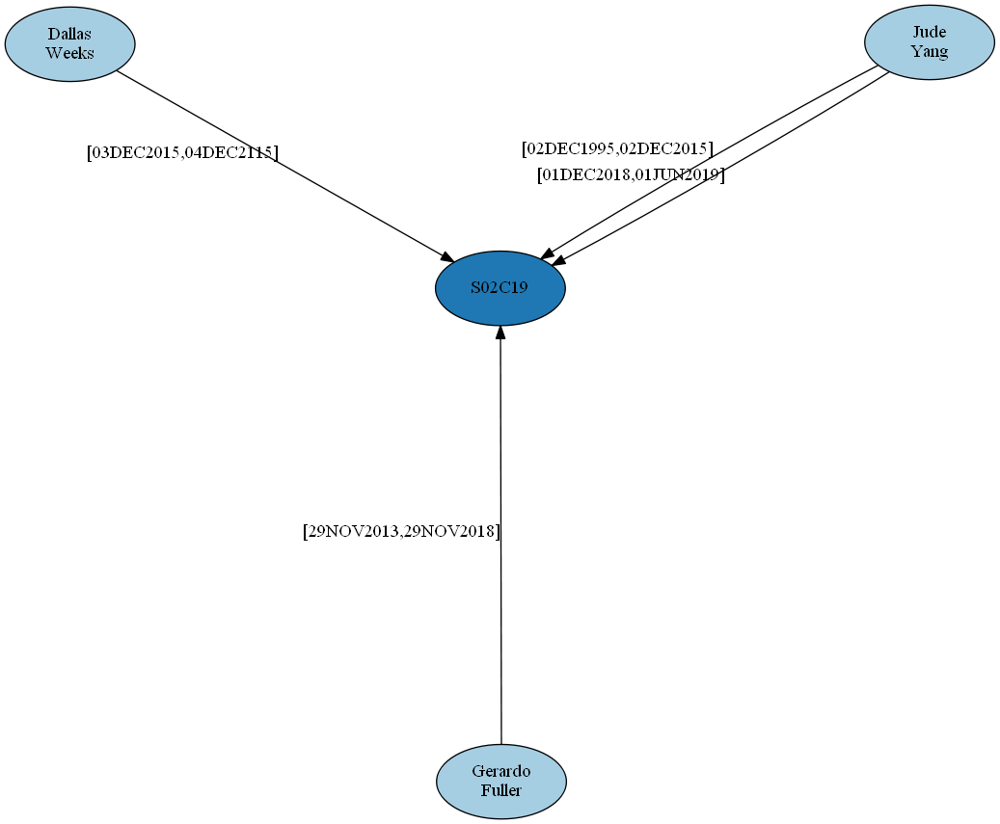

## Example 4

There is a simpler but equivalent way to find the results of Example 3. With the appropriate data model, what we are searching for are simply cliques. In the desired data model, inmates are the only nodes, and links between inmates exist when they overlapped in time in some cell. In example 4, we construct this data model using PatternMatch and then search for cliques using the clique algorithm.

**Query graph for data model transformation**

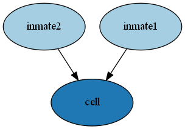

And here are the seven matches. For convenience of display, the shared cell and period of overlap are shown as link properties.

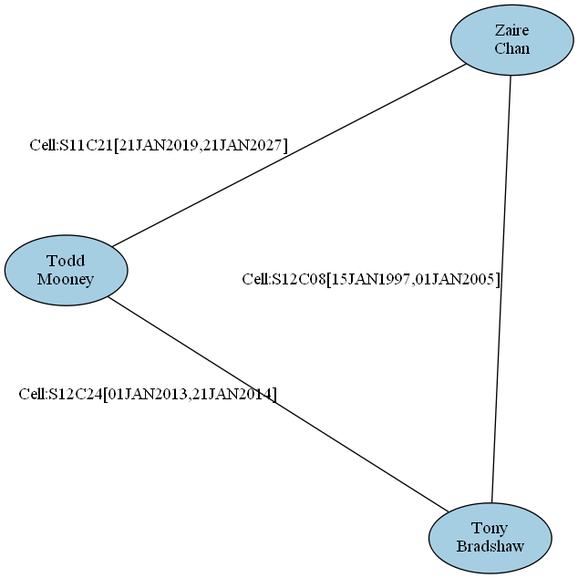
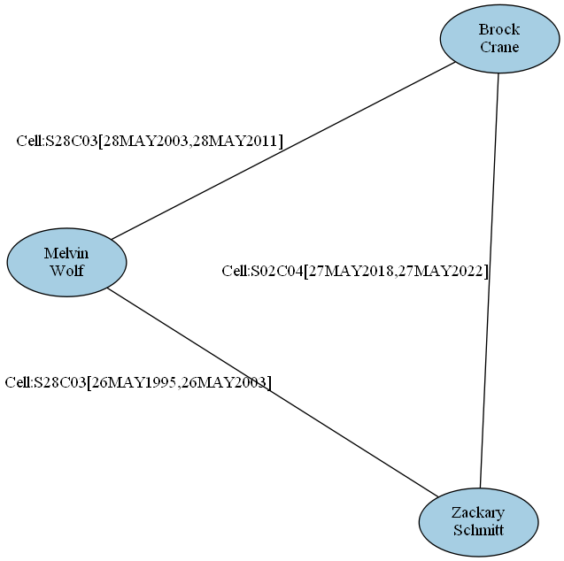

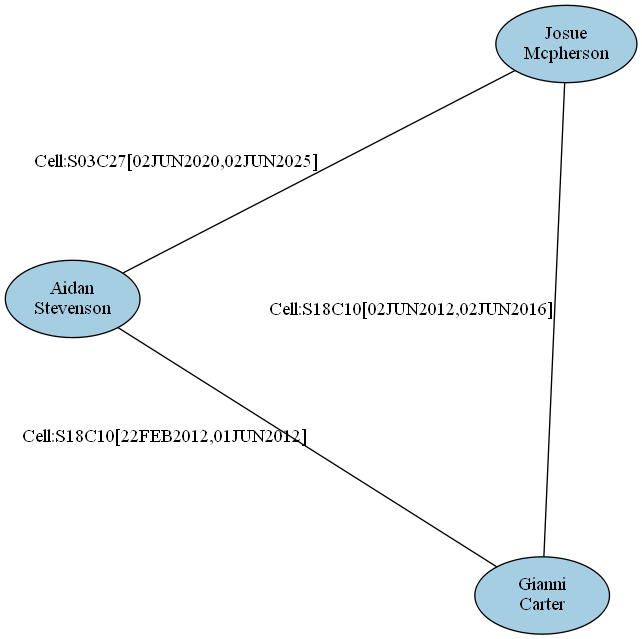