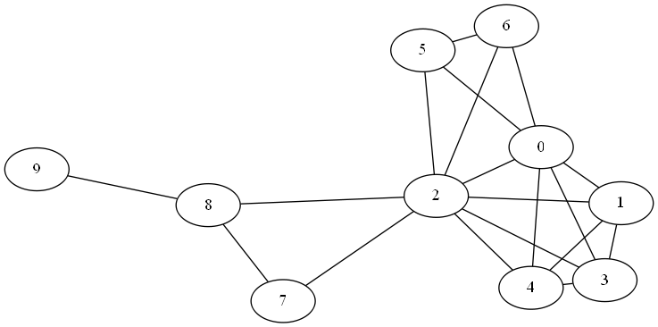
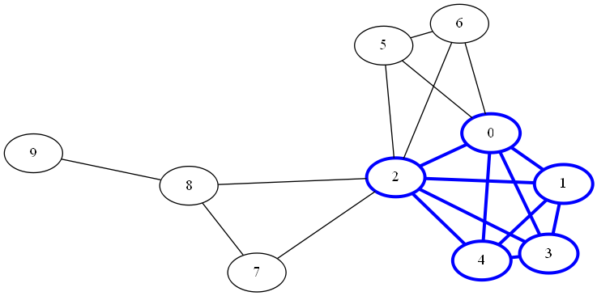
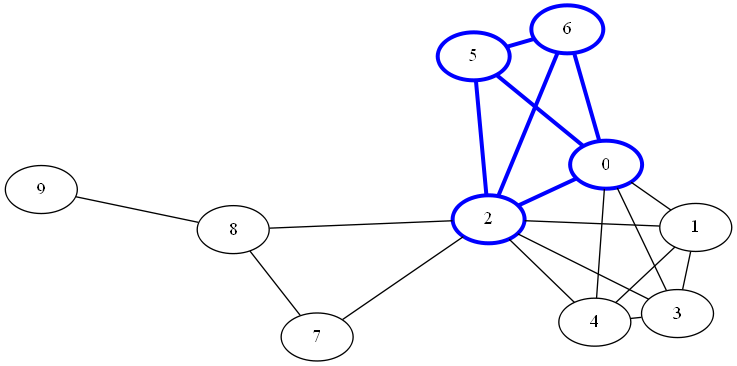
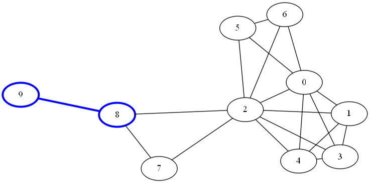

# Clique Enumeration Examples

These small examples demonstrate the syntax for finding maximal cliques.

## Example 1: Maximal Cliques of an Undirected Graph

This section illustrates the use of the clique algorithm on the undirected graph *G*.

A clique of graph *G* is an induced subgraph that is a complete graph. Every node in a clique is connected to every other node in that clique. A maximal clique is a clique that is not a subset of the nodes of any larger clique. That is, it is a set *C* of nodes such that every pair of nodes in *C* is connected by a link and every node not in *C* is missing a link to at least one node in *C*.

Example 1 in the script <a href="sas/algo_examples.sas">algo_examples.sas</a> provides the steps to run clique enumeration.

As a result, four maximal cliques are detected. The sizes of the cliques are 5, 4, 3, and 2 nodes, respectively:

