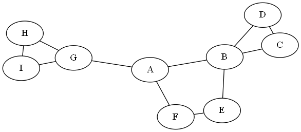
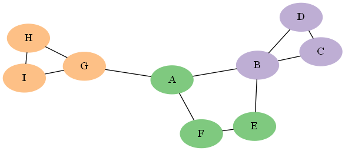
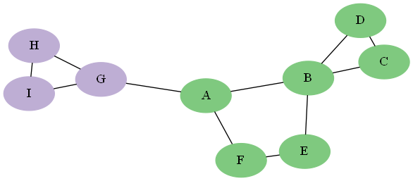
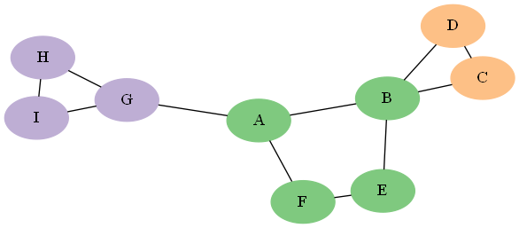
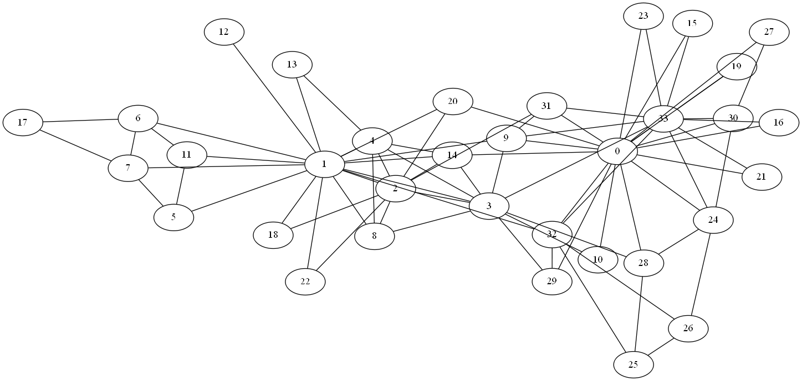
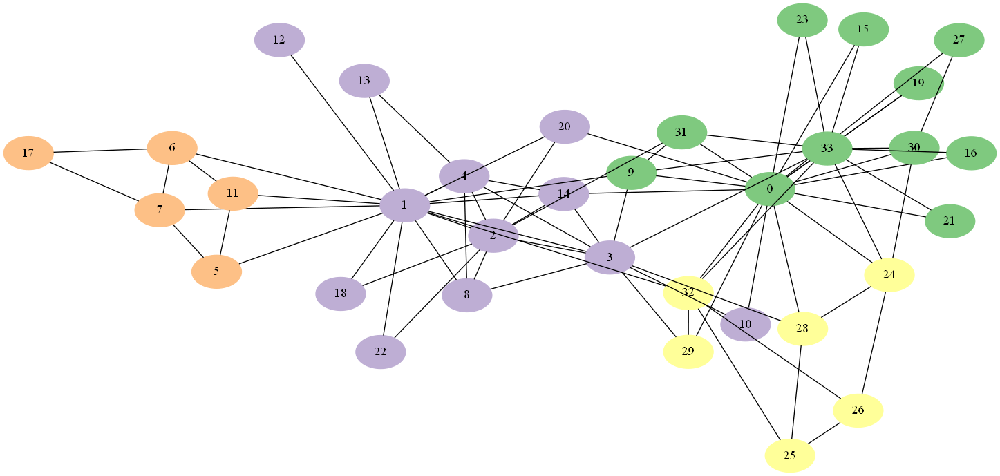
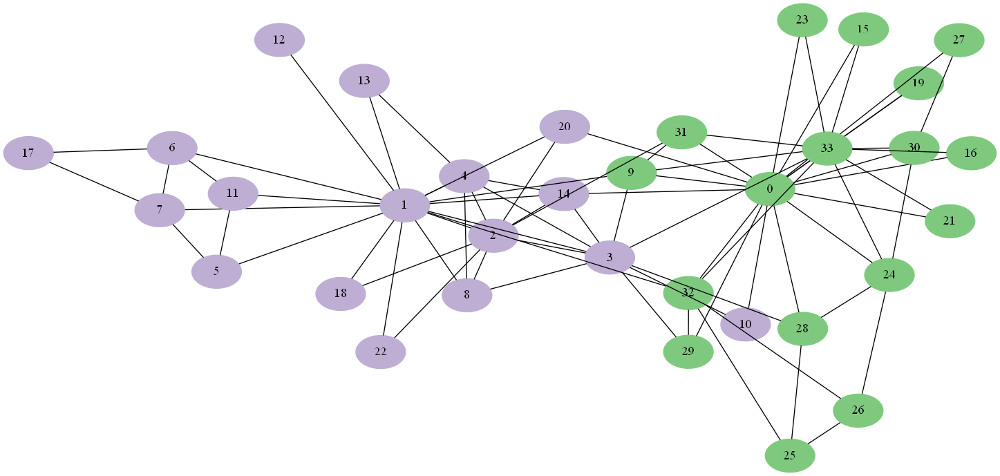

# Community Detection Examples

These small examples demonstrate the syntax for community detection.

## Example 1: Community Detection on an Undirected Graph

This section illustrates the use of the community detection algorithm on the undirected graph G.

Example 1 in the script <a href="sas/algo_examples.sas">algo_examples.sas</a> provides the steps to run community detection using two different resolution settings.

Using resolution 1.0, three communities are detected:

Using resolution 0.5, two communities are detected:

## Example 2: Fixing Nodes for Community Detection

This section continues the example in the section [Community Detection on an Undirected Graph](#example-1-community-detection-on-an-undirected-graph) and illustrates fixing nodes together for community detection on the graph G. Suppose you want to fix nodes A and B in the same community, nodes C and D in the same community, and nodes H and I in the same community. Example 2 in the script <a href="sas/algo_examples.sas">algo_example.sas</a> provides the steps to run community detection with fixed grouping constraints.

Using these constraints, three communities are detected:

## Community Detection on Zachary’s Karate Club Data

This example uses Zachary’s Karate Club data (<a href="https://go.documentation.sas.com/?docsetId=casmlnetwork&docsetTarget=casmlnetwork_network_references.htm&docsetVersion=8.5&locale=en&showBanner=walkup#casmlnetwork_networkzach_w77">Zachary 1977</a>), which describes social network friendships between 34 members of a karate club at a US university in the 1970s. This is one of the standard publicly available data tables for testing community detection algorithms. It contains 34 nodes and 78 links. The graph is shown below.

The script <a href="sas/karate_club_example.sas">karate_club_example.sas</a> provides the steps to run community detection using two different resolution settings.

Using resolution 1.0, four communities are detected:

Using resolution 0.5, two communities are detected:

