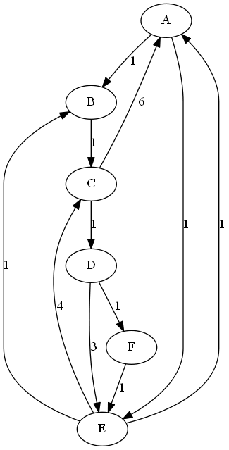
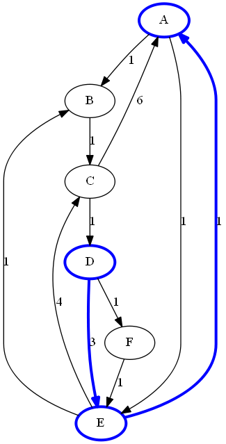
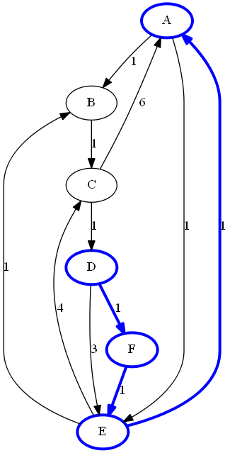
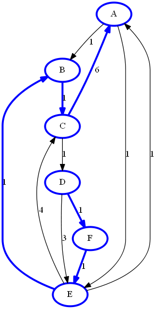

# Path Enumeration Examples

These small examples demonstrate the syntax for finding elementary paths.

## Example 1: Path Enumeration for One Source-Sink Pair

This section illustrates the use of the path algorithm on the directed graph *G*.

A path in graph *G* is a sequence of links such that the to node of each link is the from node of the next link. An elementary path is a path in which no node is visited more than once. A path between two nodes, *i* and *j*, in a graph is a path that starts at *i* and ends at *j*. The starting node is called the source node, and the ending node is called the sink node.

Example 1 in the script <a href="sas/algo_examples.sas">algo_examples.sas</a> provides the steps to enumerate paths between a source node *D* and sink node *A* with an upper limit, 10, on cumulative path weight.

As a result, three paths are detected.

