# Projection Examples

These small examples demonstrate the syntax for network projection.

## Example 1: Network Projection of an Undirected Bipartite Graph

This section illustrates the use of the network projection algorithm on the bipartite graph G, which has two partitions {A,B,C,D,E} and {1,2,3,4,5,6}. 

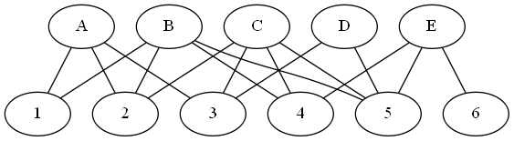

In a bipartite graph, nodes within each partition have no links among themselves.

Example 1 in the script <a href="sas/algo_example.sas">algo_example.sas</a> or notebook <a href="python/algo_example.ipynb">algo_example.ipynb</a> provides the steps to run network projection to infer links between pairs of nodes in the {A,B,C,D,E} partition, based on their neighbors in common among the {1,2,3,4,5,6} partition.

Here is the projected graph, where the number of common neighbors is represented as the inferred link's weight:

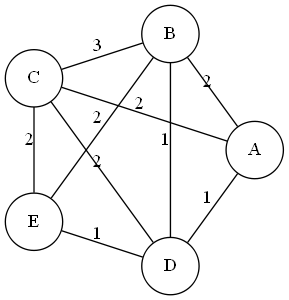

## Example 2: Network Projection of a Directed Bipartite Graph

This section provides additional examples to illustrate the three ways to define projection on a graph with directed links. 

Consider the directed graph:

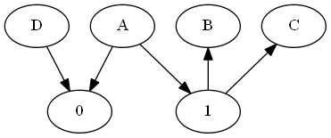

There are two partitions, {A,B,C,D} and {0,1}.

Example 2 in the script <a href="sas/algo_example.sas">algo_example.sas</a> or notebook <a href="python/algo_example.ipynb">algo_example.ipynb</a> provides the steps to run network projection to infer links between pairs of nodes in the {A,B,C,D} partition, based on their neighbors in common among the {0,1} partition using three different conditions on link direction.

When you specify DIRECTEDMETHOD=converging, links are inferred between node pairs that share one or more common out-neighbors:

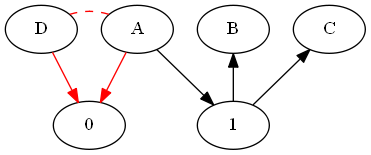

The resulting undirected graph has one link:

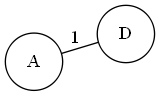

When you specify DIRECTEDMETHOD=diverging, links are inferred between node pairs that share one or more common in-neighbors:

The resulting undirected graph has one link:

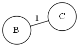

When you specify DIRECTEDMETHOD=transitive, links are inferred between node pairs that have a directed path of length 2, traversing a common neighbor:

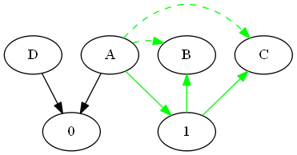

The resulting directed graph has two links:

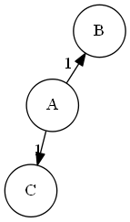

## Using Projection to Recommend Recipe Ingredient Pairings

This example solves a recommendation problem that links similar ingredients together based on recipe data. By using the projection algorithm, you can find pairs of ingredients that occur together in one or more recipes. In the input data for this example, the inclusion of ingredients in recipes is organized into a bipartite network G. For ease of depiction, the various ingredients are represented by id number in the range 1 through 34, and their inclusion in each of the six recipes is represented by a dotted link: 

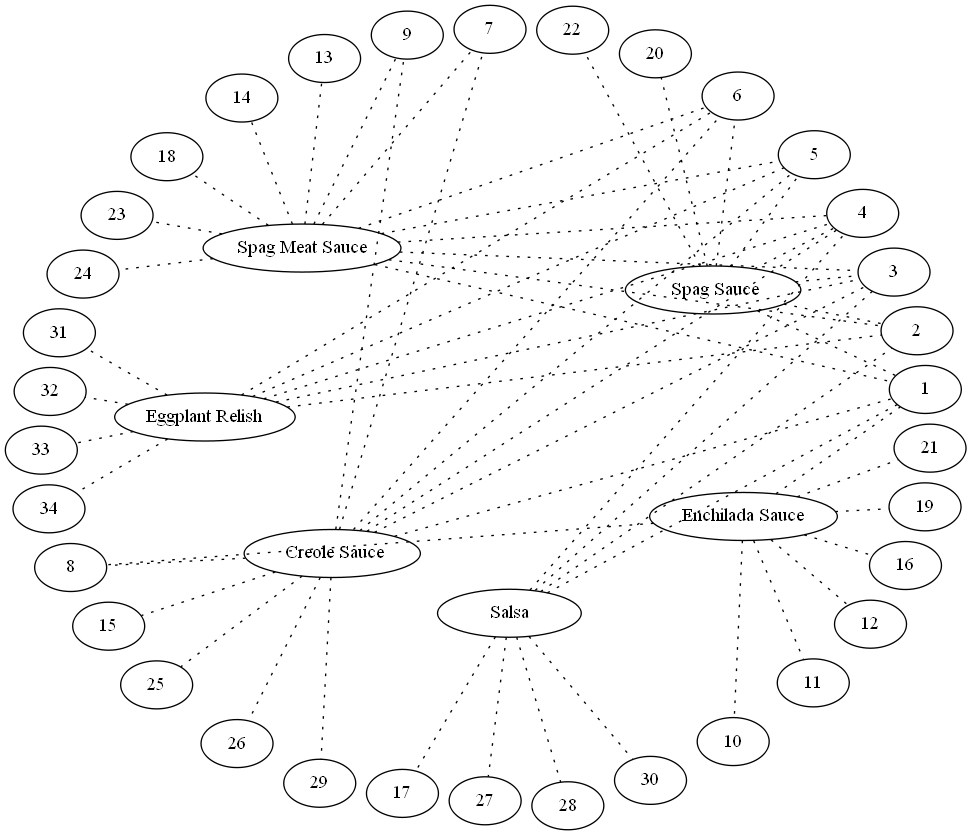

The script <a href="sas/recipe_example.sas">recipe_example.sas</a> and notebook <a href="python/recipe_example.ipynb">recipe_example.ipynb</a> provide the steps to run network projection to infer links between pairs of ingredients.

The projected links output table contains the ingredient pairings that occur in three or more recipes. For example, garlic and olive oil have three common neighbors, which means they occur together in three recipes.

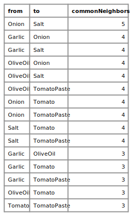

Strongly linked ingredients are likely good candidates for combination in future recipes.

You can also check the neighbors list output table to display the particular recipes that contain both garlic and olive oil:

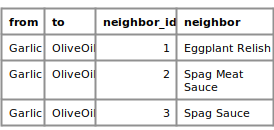

This subset of the neighbors list output table indicates that eggplant relish, spaghetti sauce, and spaghetti meat sauce are the three recipes that contain both garlic and olive oil.